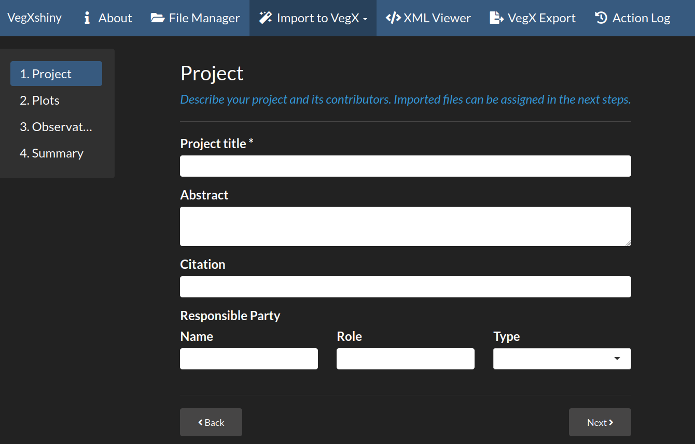

<!-- README.md is generated from README.Rmd. Please edit that file -->

```{r, include = FALSE}
knitr::opts_chunk$set(
  collapse = TRUE,
  comment = "#>",
  fig.path = "man/figures/README-",
  out.width = "100%"
)
```

# VegXshiny - An interactive web application for vegetation ecologists

<!-- badges: start -->
[](https://github.com/ChrKoenig/VegXshiny/actions)
[](https://app.codecov.io/gh/ChrKoenig/VegXshiny?branch=master)
[](https://lifecycle.r-lib.org/articles/stages.html#experimental)
<!-- badges: end -->

## Background

The increasing digitization of research data has motivated data standardization efforts across scientific disciplines. The vegetation science community has 
recognized the need for a standardized exchange format since at least 2003 and developed the initial version of the Veg-X standard in 2008 (Wiser et al., 2011). 
Veg-X is implemented as an XML schema that provides both flexibility and precision in representing vegetation data of different origin and format.

Veg-X has not found wide adoption among vegetation ecologists to this date. One of the reasons for this was the lack of tools to easily create 
Veg-X documents. A major step towards improving the usability of Veg-X was the publication of the VegX R-package (De Cáceres, 2018),
which provides tools for importing, integrating and exporting vegetation data using the Veg-X standard. While the VegX package allows users to 
create Veg-X documents using R programming language, interest in a GUI-based application for Veg-X remained high.

<center>
{width=700px}

*VegXshiny has an intuitive graphical user interface to guide the user through the conversion process*
</center>

**VegXshiny aims to make the conversion of vegetation data into Veg-X documents as easy as possible.** The graphical user interface of VegXshiny helps users, who have 
no experience with programming or markup languages (XML in this case), to build valid Veg-X documents and implement best practices in terms of data management and 
interoperability. Dynamic import dialogs guide users through the process of mapping their data to the corresponding Veg-X elements, while ensuring that the generated 
XML conforms to the Veg-X standard. The ability to view and edit input files and output VegX documents gives users full control over their data. Finally, an interactive 
tree viewer of the Veg-X schema helps making the standard accessible and understandable.

The development of VegXshiny is endorsed by the [International Association for Vegetation Science (IAVS)](http://iavs.org/).

<div style="text-align:center">
  <a href="http://37.120.167.83" target="_blank">
    CLICK HERE TO OPEN THE APP ONLINE
  </a>
</div>

**References**:

Wiser, S.K., Spencer, N., de Cáceres, M., Kleikamp, M., Boyle, B., Peet R.K. (2011): Veg-X – an exchange standard for plot-based vegetation data. – Journal of Vegetation Science 22: 598–609.

De Cáceres (2018): VegX: Vegetation data in Veg-X. R-package, https://iavs-org.github.io/VegX

### VegXShiny R package development:

* Christian König
* Sebastian Schmidtlein

### Veg-X standard development:

* Miquel De Cáceres
* Sebastian Schmidtlein
* Susan K. Wiser
* Nick Spencer
* Robert K. Peet
* Martin Kleikamp
* Brad Boyle
* Christian König


